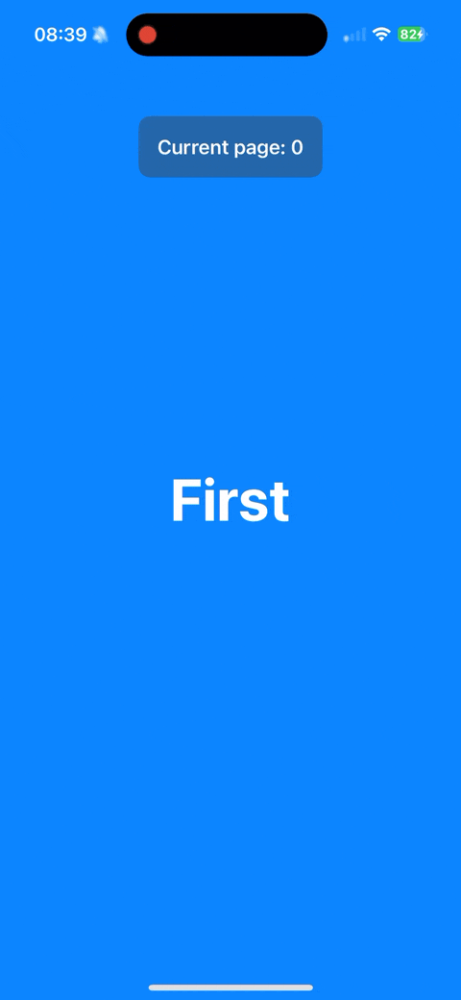

# FeedView — A SwiftUI Paging Feed with Smooth Scroll Transitions
FeedView is a SwiftUI component for building full-screen, scrollable feeds with smooth, customizable transitions. It supports paging and provides built-in styles like:

 * plain (blur + fade)
 * rotation (3D page tilt effect)
 * cardFlip (horizontal card flipping)

Just pass your data and choose a style — FeedView handles scroll offset tracking, animations, and index binding for you.
Perfect for modern onboarding screens, story feeds, carousels, and more.


## Usage 

```swift
 FeedView(data: values, currentIndex: $index, style: .rotation) { item in
        ZStack {
            Color(item.color)
            Text(item.title)
                .foregroundStyle(.white)
                .font(.system(size: 50, weight: .bold))
        }
    }
    .overlay(alignment: .top) {
        Text("Current page: \(index)")
            .font(.headline)
            .padding()
            .background(.ultraThinMaterial)
            .cornerRadius(10)
            .padding(.top, 40)
    }
```
<table>
<tr>
<td width="50%">

```swift
.scrollTransition { content, phase in
    content
        .blur(radius: abs(phase.value) * 7)
        .opacity(1 - abs(phase.value) * 0.25)
}
```

</td> <td width="50%"> <div align="center">  </div? </td> </tr> 

<tr>
<td width="50%">

```swift
.scrollTransition { content, phase in
    content
        .rotation3DEffect(
            .degrees(-phase.value * 90),
            axis: (x: 1, y: 0, z: 0),
            anchor: UnitPoint(x: 0.5, y: 0.5 - phase.value * 0.5),
            perspective: 1.5
        )
        .opacity(1 - abs(phase.value) * 0.25)
}
```

</td> <td width="50%"> <div align="center">  </div? </td> </tr> 

<tr>
<td width="50%">

```swift
.scrollTransition { content, phase in
    content
        .rotation3DEffect(
            .degrees(-phase.value * 180),
            axis: (x: 0, y: 1, z: 0),
            anchor: .center
        )
        .opacity(1 - abs(phase.value) * 0.25)
}
```

</td> <td width="50%"> <div align="center">  </div? </td> </tr> 
</table> 
